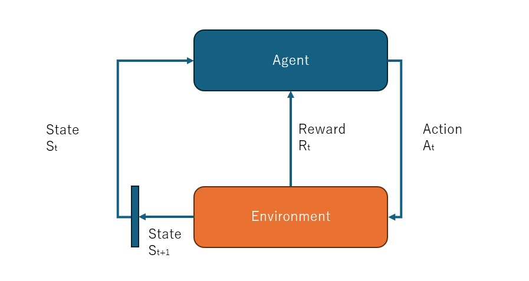

# What is Markov Decision Process
When we looked at Multi Armed Bandit problem, we said 
that on each round *Agent* was faced with the same number of Slot machines.
Which means, regardless of *Agent*'s actions, the **state** of the environment didn't change.
But in reality, every *action* has a *reaction*.
In other words, when *Agent* takes an action, it causes a change in the **state** of the environment.
In the example of board games like chess, every time *Agent* moves a figure, the combination of figures on the board change, i.e. the **state** changes and the **Agent** has to **decide** his next best move taking that into consideration.

Subset of processes of making decisions where *Agent*'s actions changes the *state* is framed as **Markov Decisio Process**. In this chapter, first we will explain **concepts** that arise in **MDP**, and express them with Math symbols. Then we will clarify **MDP**'s goal and solve a simple problem how **MDP** achieves its goal.

# MDP
In **Markov Decision Process**, **decision** corresponds to **Agent** choosing **actions** based on **state** changes.
Let's use a specific example.

Welcome to one dimensional **Grid World**. The robot is in the middle and he can either move to the right or to the left. There is a bomb in the rightmost corner and there is an apple in the leftmost corner. When Robot moves to the cell with apple, he will receive a reward of +1, when he moves to the cell with a bomb, he explodes and receives a reward of -2. When the cell is empty, reward is zero.
Robot is our **Agent**. **Grid World** is our **Environment** and the position of the **Agent** with respect to apples and bomb is the **State**.

As the **Agent** moves along the **Grid**, the **State** changes.
Programmatically we could express the *state* as the position of the robot with respect to the apple and the bomb.
Imagine our *Grid World* is one dimensional and consists of 5 cells. 
Let's take an example where robot makes two moves to the right and express how **State** changes at each move.
Let's call each *move* a *time step*. 
Before making first move, time step is 0, after making first move time step becomes 1, and after making second move time step becomes 2.

- At time step 0 *State* is : Apple is 2 cells to the left of the Robot and Bomb is 2 cells to the right of the robot. if we express objects to the left of the Robot as negative distance and to the right as positive distance, then we could express the state at time zero as (-2,2).

- At time step 1, after robot makes one move to the right, the *State* is : (-3,1), and Robot receives *reward* of 0.

- At time step 2, after robot makes one more move to the right, the *State* becomes : (-4, 0) and Robot receives *reward* of -2.

We could use one more example where from initial State (-2, 2) (where apple is two cells to the left and bomb is two cells to the right of the Robot), Robot makes two moves to the left

- At time step 0, State is (-2,2). Robot takes action of moving one cell to the left
- At time step 1, State is (-1,3) and Robot receives reward of 0. Robot takes action of moving one cell to the left.
- At time step 2, State is (0,4) and Robot receives reward of +1.

In this simple example it is clear that the optimal action for the Robot is making two moves to the left from the initial state to receive the reward of +1.

In MDP, the concept of **time step** is necessary. At a certain time step Agent takes an action, the environment moves to the next time step and the state changes and the Agent takes the next action and the time step moves further. Time step is the interval during which the Agent makes a decision about next action.

Let's consider trickier Grid World. Again we have 5 cells. Robot is in the middle, i.e. in cell 3 from the left. In cell 1 from left there is 1 apple. In cell 4 from left there is a bomb and in cell 5 from left there are 6 apples. When robot visits the cell with 1 apple, it receives a reward of +1. When it visits the cell with 6 apples it receives reward of +6. When it visits the cell with the bomb, it gets a reward of -2.

|1 Apple | Empty Cell  |Agent | Bomb | 6 Apples|
|---|---|---|---|---|

In this case, what is the optimal path of actions for the Agent? The optimal series of actions is to get to the cell with 6 apples. Because even if it gets punished with -2 reward when it visits the cell with the bomb, eventually it will get reward of +6 when it visits the cell with apples and its total net reward will be +4, which is better than having only +1 by visiting the leftmost cell with one apple.

This is the lesson of life, no risk no reward.

## Agent Environment Interaction

The interaction between the Agent and the Environment can be depicted as in the image below. Again with every action the Agent takes, the State of the Environment changes and the Agent receives a corresponding Reward.
In the image below, Agent starts from State t, takes and Action At, receives Reward Rt and the environment transitions to State t+1. And this interaction continues either until the Agent achieves its goal or infinitely.

This process of the Agent starting from initial state and goint through iterations of taking actions and receiving rewards can be denoted as below

$$
S_0, A_0, R_0, S_1, A_1, R_1, S_2, A_2, R_2,...
$$

In this time series, Agent starts from state $$S_0$$, it takes action $$A_0$$ and receives reward $$R_0$$ and transitions to State $$S_1$$...

## Formulation of Agent and Environment

MDP frames the interaction between the Agent and the Environment using formulas. To achieve this we have to define following components using formulas

- **State transition** : How the *Environment* transition from one *State* to another

- **Reward** : How the Agent receives a *Reward*

- **Policy** : How the Agent decides the next *Action*

## State Transition
Let's start with state transition. Again we return to our Robot that moves in one dimensional Grid World to the left or to the right. So the set of actions that the Agent can choose from are {"To the Left", "To the Right"}.
Let's say the Agent decided on action "To the Left". There can be two types of state transitions.

- **Deterministic** : The environment will deterministically transition to the next concrete state based on current state and chosen action. In the example of the Robot in the Grid World, if Robot decides to move to the left, it will definitely move the cell on its left. In this case next state $$s'$$ is deterministically derived by **State Transition Function**
$$
s' = f(s,a)
$$

- **Stochastic** : The environment will probabilistically transition to more than one state based on the current state and chosen action. We can denote this as below.
$$
p(s' | s, a)
$$
Probability of the environment transitioning to state $$s'$$ given the current state *s* and chosen action *a*

Let's again use the example of one dimensional *Grid World* with 5 cells. Cells are labeled as L1, L2, L3, L4 and L5. The robot is in cell L3. The Robot chooses action to move to the *Left*. And let's say that Robot actually moves to the cell on the left with probability 0.9 and will remain in the same cell with probability 0.1. 
*State transition probability* can be denoted as 
$$ 
p(s' | s = L3, a = Left)
$$

And *State Transition Probability Distribution* is as follows

| L1 | L2 | L3 | L4 | L5 |
|---|---|---|---|---|
| 0 | 0.9 | 0.1 | 0 | 0 |

Note that *Deterministic* state transition can be described with *Stochastic* state transition. All you need to say is that Robot will move to the cell on the left with probability 1.0. 

Notice that the next state *s'* in State Transition is determined based on *current state* and chosen action only. In other words, the states preceding the current state are completely ignored. Real life is not as simple as this. My tomorrow can not be determined based on what I do today only. All my past actions in the past will determine my tomorrow, so I can not really ignore days preceding *today*.
Such property where next state is determined by current state only is called *Markov Property*. *Markov Property* makes a strong suggestion that all the information necessary to decide the next state is encoded into the current state, so you can ignore all past states.

MDP (Markov Decision Process) takes advantage of Markov Property to model *State Transition*. *Markov Property* makes it easy to model *State Transition*. Otherwise we would have to consider all past states and actions which would make our modeling problem exponentially complex.

## Reward Function
We will assume that our reward function is deterministic. At state *s*, when Agent takes action *a*, it transitions to next state *s'* and receives reward *r*. This is denoted as

$$
r(s,a,s')
$$

Let's again use the example of the Robot in one dimensional Grid World. Robot is in cell L2, and there is an apple in cell L1. Robot decides to move to the left. In this case the reward is

$$
r(s=L2, a=Left, s'=L1) = 1
$$

Because in the Grid World reward is determined by the state into which Robot transitions, we could denote reward as depending on *s'* only and write
$$
r(s'=L1) = 1
$$

Note that reward can be stochastic. For instance in the games, when an Agent visits a certain cell, it could be attacked by an enemy with 0.8 probability and receive reward of -10 and not get attacked by the enemy and actually get reward of +10 with 0.2 probability. But even in such cases we can use expected value of reward at that state as deterministic value. And this will help when solving problems that can be modeled as MDP. Later we will discover Bellman Equation that will solve such problems.

## Agent Policy

Finally let's think about denoting how the Agent chooses an action. Under MDP, Agent chooses next action based on current state only. There is no need for the Agent to think about past states. MDP requires that all the information required to choose next action is encoded into the current state. 
Such Markov Property is not a limitation for the Agent, it is a limitation for the Environment. The Environment must be designed in such a way that all the information necessary for the Agent to make the next move is encoded into the current state.

Choosing actions can also be categorized to *deterministic* and *probabilistic*. 

- Deterministic : when at state *s* agent chooses one concrete action *a*. E.g. when in cell L2, Robot will move Left.
$$
a = \mu(s)
$$

$$
\mu(s=L2) = Left
$$

- Probabilistic : Agent can choose actions with certain probabilities. E.g. when in cell L3, Robot choose action Left with 0.6 probability and action Right with 0.4 probability

$$
\pi(a = Left | s = L3) = 0.6
$$

$$
\pi(a = Right | s = L3) = 0.4
$$

Again *deterministic* action choosing can be thought of as special case of *probabilistic* action choosing. Because we can easily express deterministic action choosing using probabilistic denotion. All we need to say, probability of Robot choosing action Left when in cell L3 is 1.0.
